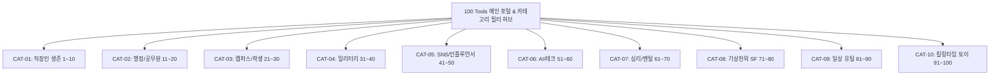

# 100대 도구 대기획 프로젝트 (Project 100 Tools) Implementation Plan

전 세계 최신 인터넷 트렌드(X/트위터, 스레드, 인스타그램, 유튜브 숏폼, 오피스, 행정/공무원, 캠퍼스, 밀리터리, 최신 AI, 심리/멘탈, 기상천외 SF, 일상 유틸리티, 킬링타임 웹토이)를 아우르는 **100개의 창의적 웹 도구 컬렉션**을 기획하고 순차적으로 제작하는 대규모 프로젝트입니다.

## User Review Required

> [!IMPORTANT]
> 100개의 도구는 단발성 아이디어가 아니라, 실제로 동작하는 웹 브라우저 네이티브 도구/토이로 구현됩니다.
> 전체 목록(1번~100번)이 확정되었으며, 개발의 체계성과 높은 완성도를 위해 **10개 카테고리(각 10개씩)**로 나누어 단계별(Phase 1 ~ Phase 5)로 차근차근 제작을 진행합니다.

## Proposed 100 Tools Specifications (1 ~ 100)

### 💼 CAT-01: K-직장인 & 오피스 생존 키트 (01 ~ 10)
1. **가짜 엑셀 몰컴 뷰어 (Stealth Excel Tab)**: 스페이스바 누르면 0.05초 만에 결산 재무제표로 변하는 몰컴 전용 뷰어.
2. **넵병 탈출기 & 사회생활 쿠션어 번역기 (Corporate Politeness Converter)**: 속마음을 우아하고 정중한 비즈니스 쿠션어로 5단계 강도 조절 변환.
3. **실시간 연봉 시급화 & 응가 머니 계산기 (Resignation & Salary Ticker)**: 1초마다 통장에 쌓이는 돈(초당 몇 원)과 화장실 타임 동안 번 돈 계산.
4. **칼퇴 카운트다운 & 비상 탈출 핑계 생성기 (Escape Office Clock & Excuse Gen)**: 칼퇴 시계와 야근 방어용 핑계 및 가짜 전화벨 재생.
5. **법카 한도 맞춤형 식대 조합기 (Company Card Budget Optimizer)**: 법카 잔액을 0원에 가깝게 털 수 있는 배낭 알고리즘(Knapsack) 최적 메뉴 조합기.
6. **영수증 N빵 분할 & 정중한 송금 독촉장 (Dutch Pay & Polite Chaser)**: 지각/불참자 차등 계산 및 카톡용 초정중 송금 독촉 짤/멘트 복사.
7. **회의록 버즈워드 추출기 & 회의 불필요도 판독기 (Meeting Buzzword Extractor)**: "아젠다/얼라인" 허세 단어 빈도 분석 및 이메일로 대체 가능했던 확률 계산.
8. **글로벌 비즈니스 영문 메일 톤 조절기 (Cold Email Diplomat)**: 격식과 분노 지수에 맞춘 세련된 영문 비즈니스 이메일 템플릿 빌더.
9. **월급루팡용 가짜 윈도우/맥 업데이트 화면 (Fake OS Update Screen)**: 전체화면으로 띄워놓고 커피 마시러 가는 극도로 느린 업데이트 시뮬레이터.
10. **슬랙/잔디 일하는 척 상태메시지 생성기 (Presence Status Generator)**: "고객사 긴급 콜 중" 등 신뢰도 200% 사내 메신저 상태메시지 프리셋.

### 🏛️ CAT-02: 공무원 & 행정 & 민원 마스터 (11 ~ 20)
11. **공문서 행정체 번역기 (Official Bureaucracy Style Converter)**: "그거 못합니다" -> "종합 검토한 바 수용 곤란함을 회신하오니..." 6하원칙 공문 변환.
12. **악성 민원 방어 멘탈 쉴드 & 법적 대응 스크립트 (Civil Complaint Calmer)**: 억지 민원인 유형별 법적 표준 대응 스크립트 및 4-7-8 심호흡 가이드.
13. **행정용어 순화 사전 & 쉬운 우리말 검색기 (Plain Admin Language Finder)**: '명기하다', '시달하다' 등 난해한 한자어를 알기 쉬운 우리말로 상호 치환.
14. **관공서 보도자료 헤드라인 & 엠바고 생성기 (Press Release Header Maker)**: 1면에 실릴 법한 강력한 헤드라인, 3단 부제, 엠바고 문구 자동 생성.
15. **연말 불용 방지 예산 털기 장바구니 시뮬레이터 (Fiscal Year-End Budget Burner)**: 남은 예산 금액에 딱 맞춰 합법적 비품/사무용품 장바구니 추천.
16. **감사(Audit) 공포증 극복 체크리스트 (Audit Panic Checker)**: 출장 영수증 시간, 법카 시간외 사용 등 감사 단골 지적 항목 인터랙티브 점검.
17. **보고서 분량 늘리기/줄이기 매직 포맷터 (Doc Page Adjuster)**: 1.2페이지짜리를 1페이지로, 혹은 0.8페이지짜리를 꽉 채우는 자간/행간 최적화 가이드.
18. **행사 의전 서열 & 좌석 배치도 생성기 (Protocol Seating Chart Calculator)**: 기관장, 국회의원 직급별 의전 서열(좌청룡 우백호) 다이어그램 렌더러.
19. **국회/의회 청문회 답변 회피 시뮬레이터 (Hearing Evasion Simulator)**: "기억이 나지 않습니다", "수사 중인 사안이라..." 노련한 답변 룰렛.
20. **퇴근 1분 전 민원인 방문 포커페이스 타이머 (Closing Bell Radar)**: 17시 59분에 문 열고 들어오는 민원인 앞에서의 포커페이스 유지 타이머.

### 🎓 CAT-03: 캠퍼스 & Z/알파 세대 라이프 (21 ~ 30)
21. **학점 복구 & 재수강 시뮬레이터 (GPA Recovery Calculator)**: 졸업 컷 또는 4.0 달성을 위해 남은 학기에 받아야 하는 초인적 학점 시뮬레이션.
22. **조별과제 무임승차(빌런) 판독기 & 기여도 보고서 (Free-Rider Detector)**: 카톡 참여율, 오타율 등을 점수화하여 교수님 제출용 기여도 증빙표 생성.
23. **과제 마감 카운트다운 & 멘붕 게이지 (Deadline Panic Meter)**: 마감 시간이 다가올수록 화면이 붉어지고 심장 박동 사운드가 빨라지는 압박 타이머.
24. **Z/알파 세대 글로벌 슬랭 번역기 (Gen Z/Alpha Slang Translator)**: Skibidi, Rizz, Gyatt, 뇌절, 폼 미쳤다 등 젠지 슬랭과 기성세대어 상호 번역.
25. **시험기간 벼락치기 카페인 치사량 & 생존 계산기 (Caffeine Overdose Safe Limit)**: 몬스터, 핫식스, 커피 조합 시 최대 각성 시간 및 심장 경고 계산.
26. **교수님 심기 경호 이메일 빌더 (Dear Professor Email Builder)**: 성적 정정, 증원 신청 등 교수님 심기를 거스르지 않는 극존칭 이메일 빌더.
27. **레포트 분량 뻥튀기 학술 만연체 생성기 (Essay Word Count Expander)**: 1,000자 과제를 화려한 수식어로 2,500자로 불려주는 만연체 변환기.
28. **학식 vs 편의점 vs 배달 잔고 룰렛 (Campus Lunch Roulette)**: 내 지갑 잔고(2,500원/6,000원/15,000원)에 따라 강제로 점지해 주는 룰렛.
29. **지옥의 통학 고통 지수 계산기 (Commute Misery Index)**: 1호선 환승, 만원 버스, 언덕길을 종합 계산하여 소모될 '영혼의 HP' 산출.
30. **수능/국가고시 실시간 경쟁자 시뮬레이터 (Exam D-Day Competitor HUD)**: "내가 멍때린 10분 동안 전국 경쟁자가 푼 문제 수"를 보여주는 각성기.

### 🪖 CAT-04: 군사 & 국방 & 밀리터리 (31 ~ 40)
31. **초정밀 전역일 & 복무율 실시간 소수점 티커 (Military Discharge Percent Ticker)**: 복무율이 소수점 7자리까지 실시간 1초 단위로 올라가는 HUD.
32. **군대 관등성명 초음속 반사속도 측정기 (Rank & Name Reaction Test)**: 불시 "야!" 소리에 "병장! 홍! 길! 동!" 반응속도(ms) 측정 게임.
33. **군대 짬밥 탈주율 & PX 냉동 폭풍 지수 (Barracks Meal Predictor)**: 조순튀, 해빔소, 똥국 등장 시 식당 탈주율 및 PX 폭풍 구매 확률 예측.
34. **불침번 & 당직 공평무사 난수 추첨기 (Night Guard Shift Allocator)**: 새벽 2~4시 기피 타임 불만을 종식시키는 암호학적 난수 기반 공평 근무표.
35. **군용 모스 부호 번역기 & 오디오 비퍼 (Morse Code Translator & Beeper)**: 텍스트를 모스 부호로 바꾸고 실제 800Hz 비프음과 화면 점멸 재생.
36. **군대 계급별 멘탈 상태 인터랙티브 토이 (Military Rank Mindset Simulator)**: 이병부터 병장까지 터치 시 계급별 명대사와 멘탈 변화 애니메이션.
37. **밀리터리 24시간제 & 줄루 타임(Zulu UTC) 변환기 (Military Zulu Time Converter)**: 0300 Hours, Zulu/Alpha 타임 및 레이더 시계 변환.
38. **전술 위장(Camouflage) 패턴 생성기 (Camo Pattern Canvas Generator)**: 디지털 픽셀, 멀티캠, 우드랜드 무늬를 무한 생성하고 배경화면 다운로드.
39. **전투식량 발열팩 대기 타이머 (MRE Heat Pack Timer)**: 보글보글 수증기 애니메이션과 함께 가장 맛있는 10분을 기다리는 타이머.
40. **예비군 & 민방위 연차 및 잔여 세월 계산기 (Reserve Duty Year Calculator)**: 동원지정, 동미참, 작계, 민방위 40세 만료일까지의 남은 달력 시각화.

### 📱 CAT-05: 소셜미디어 & 바이럴 인플루언서 (41 ~ 50)
41. **인스타그램 감성 카페 줄글 캡션 생성기 (Insta Aesthetic Caption Gen)**: 무채색 이모지, 몽환적 엔터 줄바꿈 감성 캡션 자동 조합기.
42. **유튜브 알고리즘 폭격 어그로 썸네일 제목기 (Clickbait YouTube Title Gen)**: "[충격]", "결국 터졌습니다", "이 영상은 곧 비공개..." 어그로 10종 생성.
43. **스레드(Threads) 특유의 하소연 줄글 생성기 (Threads Vibe Storyteller)**: "오늘 지하철에서 문득 든 생각입니다... (더보기)" 스레드 바이럴 문체 변환.
44. **가짜 X(구 트위터) 대한민국 실시간 트렌드 합성기 (Fake X Trending Generator)**: 내 이름이나 키워드를 트위터 실트 1위 화면으로 렌더링/캡처.
45. **쇼츠/릴스 30초 숏폼 대본 압축기 (Shorts 30s Script Condenser)**: 후킹(Hook) -> 3단계 핵심 -> 댓글 유도(CTA)로 글을 30초 스크립트 압축.
46. **인스타그램 도배 방지 황금비 해시태그 최적화기 (Hashtag Optimizer & Cleaner)**: 대형/중형/틈새 태그를 황금 비율로 12개 추출하는 클린 태그기.
47. **인플루언서 4K 사과문 공식 템플릿 생성기 (Influencer Apology Generator)**: 검은 화면, 명조체, "수익 창출을 하지 않습니다" 법적 회피형 사과문 생성기.
48. **SNS 어그로 & 논란 유발 지수 테스터 (Viral Potential Score Test)**: 글의 도파민 자극도와 댓글 싸움 가능성을 분석하여 0~100점 판정.
49. **악플 정화 마법 필터 (Hate Comment Sanitizer)**: 보기 흉한 악플을 "당신을 향한 주체할 수 없는 사랑과 질투" 등 꽃밭 문장으로 순화.
50. **팔로워 100만 가상 도파민 인플루언서 시뮬레이터 (Fake 1M Follower Simulator)**: 좋아요와 팔로우 알림이 폭포수처럼 쏟아져 내리는 도파민 충전기.

### 🤖 CAT-06: AI & 최신 테크놀로지 랩 (51 ~ 60)
51. **프롬프트 인셉션 강화기 (Prompt Supercharger)**: 단순 1줄 요청을 전문가 페르소나와 Few-shot이 장착된 최고급 프롬프트로 확장.
52. **가짜 AI 환각(Hallucination) 백과사전 (AI Bullshit Generator)**: "세종대왕 맥북 던짐 사건"처럼 그럴듯한 가짜 역사/과학 사실 생성기.
53. **인간 vs AI 튜링 테스트 블라인드 퀴즈 (Turing Test Toy)**: 실제 인간의 글과 LLM의 글 2개 중 어느 쪽이 AI인지 맞추는 퀴즈.
54. **내 직업의 AI 대체 확률 & 수명 계산기 (AI Job Replacement Meter)**: 직업명을 넣으면 AI와 로봇에 의한 대체 확률과 생존 전략 출력.
55. **아시모프 로봇 3원칙 위반 감지기 (Three Laws of Robotics Checker)**: 명령문이 SF 로봇 3대 원칙에 저촉되는지 엄숙하게 판정하는 콘솔.
56. **예술적 QR 코드 생성 & 비밀 텍스트 은닉기 (Artistic QR & Steganography)**: 컬러/로고 커스텀 QR 코드 생성 및 이미지 스테가노그래피 숨김.
57. **인스턴트 JSON 뷰어 & 비주얼 트리 정리기 (Instant JSON Beautifier & Tree)**: JSON 구문 검사, 인터랙티브 트리 뷰, 키값 검색 지원.
58. **양자컴퓨터 비밀번호 해킹 시간 측정기 (Password Quantum Cracker Time)**: 내 비밀번호를 일반 해커와 양자컴퓨터가 푸는 시간 비교.
59. **비주얼 정규표현식(Regex) 샌드박스 (Visual Regex Sandbox)**: 실시간 매칭 하이라이트 및 정규식 문법 한글 풀이.
60. **디지털 도파민 디톡스 블랙홀 (Dopamine Black Hole)**: 마우스나 화면을 전혀 건드리지 않고 암흑 속에서 버티는 디지털 단식 타이머.

### 🔮 CAT-07: 심리 & 멘탈케어 & 운명 도파민 (61 ~ 70)
61. **MBTI 16가지 극단 궁합 & 파국 시뮬레이터 (MBTI Clash & Chem Sim)**: 두 유형이 여행 갔을 때 30분 만에 싸우는 이유와 생존 팁.
62. **바삭한 디지털 포춘쿠키 & 현실 조언기 (Digital Fortune Cookie)**: 포춘쿠키를 쪼개면 바삭 소리와 함께 위트 있는 현실 조언 출력.
63. **분노의 스트레스 모니터 부수기 펀치 (Stress Screen Smasher)**: 마우스 클릭으로 모니터 유리를 쩍쩍 깨부수며 스트레스 해소하는 토이.
64. **침대 속 5분 더 자기 양심 계산기 (5 More Minutes in Bed Sickness)**: 5분 더 잘 때 발생하는 지각 확률과 택시비 지출액 계산.
65. **결정장애 종결자: 3초 동전 던지기 & 룰렛 (Indecision Terminator)**: 동전이 공중에 떴을 때 마음속으로 바라던 답을 깨우쳐주는 도구.
66. **마인드풀니스 싱잉볼 & 빗소리 백색소음 믹서 (Zen Singing Bowl & Ambient)**: 432Hz 놋쇠 싱잉볼과 빗소리, 장작불 소리를 믹싱하는 힐링 플레이어.
67. **가상 로또 1등 당첨금 20억 행복회로 분배기 (Lotto Jackpot Spending Planner)**: 아파트, 슈퍼카, 부모님 용돈 배분 시뮬레이션 및 도넛 차트.
68. **팩트폭력 T vs 무한공감 F 대사 변환기 (T vs F Empathy Switcher)**: 일상 대화를 T모드와 F모드로 비교 변환.
69. **인생 잔여 시간 메멘토 모리 시계 (Memento Mori Life Clock)**: 기대수명 기준 살아온 날과 남은 날, 남은 식사 횟수를 보여주는 모래시계.
70. **세상 모든 칭찬 머신건 (Compliment Machinegun)**: 버튼을 누를 때마다 폭풍 칭찬과 꽃가루(Confetti)를 터뜨려주는 자존감 비타민.

### 🛸 CAT-08: 기상천외 & 어처구니없는 SF 도구 (71 ~ 80)
71. **지평좌표계 고정기 (Horizon Coordinate Anchor)**: 몸을 우주 절대 좌표에 고정했을 때 지구가 나를 두고 도망가는 궤적 계산기.
72. **외계인 교신 신호 발생기 & SETI 사운더 (Alien Signal Generator)**: 1420MHz 수소선 신호 톤과 스펙트로그램 파형을 합성해 우주로 송출하는 사운더.
73. **평행세계의 나 신분증 발급기 (Multiverse Career Finder)**: 다른 차원(#7402번 지구)에서 나의 엉뚱한 직업 신분증 발급.
74. **투명인간 시뮬레이터 (Invisibility Simulator)**: 웹캠을 켜면 내가 사라지고 "아무도 당신을 보지 못합니다" 알리는 허무주의 토이.
75. **모기 박멸 가상 초음파 퇴치기 (Anti-Mosquito Frequency Toy)**: 16kHz~20kHz 초음파와 분노의 전기 파리채 사운드 재생.
76. **타임머신 탑승권 발권기 (Time Machine Boarding Pass)**: 과거(비트코인 피자데이)나 미래를 선택하면 할아버지 역설 경고가 적힌 티켓 발권.
77. **인류 멸망 아포칼립스 생존 확률 계산기 (Apocalypse Survival Calculator)**: 좀비/AI 반란 시 내 스펙으로 버틸 수 있는 생존 일수 예측.
78. **순간이동 좌표 오차 계산기 (Teleportation Drift Calculator)**: 10m 앞 공간으로 텔레포트 시 지구 자전 오차로 바닥에 박힐 확률 계산.
79. **은하 제국 세무서 가상 세금 계산기 (Intergalactic Tax Assessor)**: 산소 소비세, 지구 중력 이용료를 은하 크레딧으로 청구하는 영수증 발급.
80. **슈뢰딩거의 고양이 상자 열기 (Schrödinger's Cat Box)**: 상자를 클릭하는 순간 양자 파동함수가 붕괴되며 고양이의 생사가 결정되는 토이.

### 🛠️ CAT-09: 초경량 실전 일상 유틸리티 (81 ~ 90)
81. **글로벌 시차 & 전 세계 화상회의 골든타임 플래너 (Global Timezone Meeting Finder)**: 여러 도시가 동시에 깨어있는 겹치는 업무시간 시각화.
82. **모바일/태블릿 반응형 뷰포트 프리뷰어 (Responsive Viewport Tester)**: iPhone, Galaxy, iPad 프레임으로 반응형 웹 실시간 테스트.
83. **만능 단위 & 한국형 체감 환산기 (Universal Unit Converter)**: 표준 단위와 함께 "축구장 몇 개 크기", "코끼리 몇 마리" 체감 단위 제공.
84. **개발자 텍스트 케이스 & URL 슬러그 변환기 (Case Converter & URL Slugger)**: camelCase, snake_case, kebab-case 및 영문 URL 슬러그 변환.
85. **웹접근성 색상 명도 대비(WCAG) 판정기 (Color Contrast WCAG Checker)**: 텍스트와 배경색의 명도 대비율(AA/AAA) 실시간 측정.
86. **라이브 마크다운(Markdown) 스크래치패드 (Live Markdown Scratchpad)**: 실시간 렌더링, GitHub 스타일 서식, HTML/인쇄 지원.
87. **웹 카메라 바코드 & QR 코드 즉석 스캐너 (Barcode & QR Web Scanner)**: 카메라 및 이미지 파일로 QR과 바코드 즉시 디코딩.
88. **대용량 파일 다운로드 시간 체감 계산기 (Download Time Calculator)**: 파일 용량과 인터넷 속도로 완료 시간 및 직관적 비유 안내.
89. **대한민국 만 나이 & 띠 & D-Day 종합 계산기 (Age & Zodiac Calculator)**: 만 나이, 연 나이, 태어난 일수, 띠, 별자리 일괄 계산.
90. **휘발성 자동저장 미니멀 메모장 (Ephemeral Scratchpad)**: LocalStorage 자동 보존, 글자 수 카운트, .txt 즉시 다운로드.

### 🎮 CAT-10: 킬링타임 & 감각 인터랙티브 토이 (91 ~ 100)
91. **무한 사운드 뽁뽁이 터뜨리기 (Infinite Bubble Wrap Pop)**: 무한 스크롤되는 에어캡 뽁뽁이를 톡톡 터뜨리는 사운드 쾌감 토이.
92. **네온 파티클 분수 캔버스 (Neon Particle Fountain)**: 마우스 궤적을 따라 쏟아져 내리는 중력 파티클 인터랙티브 아트.
93. **동물 울음소리 오케스트라 피아노 (Animal Soundboard Piano)**: 고양이, 강아지, 오리 울음소리로 도레미파솔라시도 연주.
94. **약올리는 도망자 마우스 버튼 게임 (Cursor Dodger Game)**: 마우스가 다가오면 빛의 속도로 도망치는 인내심 테스트 버튼.
95. **빈티지 기계식 타자기 ASMR 타이퍼 (Vintage Typewriter ASMR)**: 1920년대 기계식 타자기 찰칵거림과 줄 바꿈 "땡!" 종소리 구현.
96. **보이지 않는 숨은 소 찾기 (Find The Invisible Cow - 한국판)**: 소리 크기와 빈도에 의존해 빈 화면의 숨겨진 보물을 찾는 게임.
97. **무한 피젯스피너 RPM 측정기 (Infinite Fidget Spinner)**: 마우스로 휙 돌리면 관성에 따라 돌며 최고 RPM을 기록하는 피젯 토이.
98. **8비트 레트로 신디사이저 칩튠 메이커 (8-Bit Chiptune Sound Maker)**: 점프, 레이저, 폭발 고전 8비트 사운드 즉석 합성 및 WAV 다운로드.
99. **김 서린 유리창 닦기 클리너 (Window Wiper Toy)**: 김 서린 유리창을 마우스로 닦아내면 숨겨진 그림이 드러나는 토이.
100. **대망의 100번째 도구: 피날레 축하 3D 불꽃놀이 (Grand 100th Celebration Fireworks)**: 100개 완주를 축하하며 화면 가득 터지는 3D 불꽃놀이 쇼.

---

## Technical Architecture & Implementation Roadmap

### 단계별 제작 실행 계획 (Execution Phases)
1. **마스터플랜 기록 및 승인 (현재 단계)**:
   - 본 문서 및 프로젝트 루트의 `PROJECT_100_TOOLS_MASTERPLAN.md`에 100개 도구 전체 기획과 사양 기록.
2. **Phase 1: 포털 허브 및 카테고리 01 (직장인 생존 01~10) 제작**:
   - 100개 도구를 검색하고 바로가기할 수 있는 모듈형 메인 허브 인터페이스 구축.
   - CAT-01 (도구 1번~10번: 가짜 엑셀, 넵병 번역기, 연봉 티커 등) 순차 구현.
3. **Phase 2 ~ Phase 5: 이후 카테고리 순차 전개**:
   - 승인 후 순서대로 카테고리별 10개씩 정밀 구현 및 사이트 연동.

## Verification Plan
- 각 도구별 브라우저 독립 실행(HTML/JS/CSS) 동작 검증
- 모바일 및 데스크톱 반응형 레이아웃 및 사운드/캔버스 렌더링 검증
- 메인 포털 허브에서의 1~100번 링크 및 검색 필터링 검증
